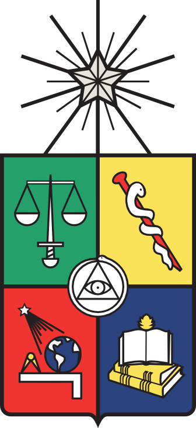

# GSM-covid19CL
 <!-- PROJECT LOGO -->
<br />
<p align="center">
  <a href="https://github.com/neurovisionhub/GSM-covid19CL">
    
    
    
  </a>

  <h3 align="center">A general modeling framework to assess COVID-19 ongoing vaccination in Chile</h3>

  <p align="center">
    Patricio Cumsille (U. Bío-Bío), Oscar Rojas (U. Santiago de Chile) and Carlos Conca (U. de Chile)
    <br />
    <a href="https://github.com/neurovisionhub/GSM-covid19CL"><strong>Explore the docs »</strong></a>
    <br />
    <br />
    <a href="https://github.com/neurovisionhub/GSM-covid19CL/blob/main/main.m">main call</a>
  </p>
</p>

 <p align="center">Colaborative research: Department of Basic Sciences, Faculty of Sciences, University of Bío-Bío; Department of Mathematics and Computers Science, Faculty of Science, University of Santiago of Chile; Department of Mathematical Engineering (DIM) and Center for Mathematical Modeling (CMM), University of Chile and Centre for Biotechnology and Bioengineering (CeBiB), University of Chile,</p>


<!-- TABLE OF CONTENTS -->
<details open="open">
  <summary><h2 style="display: inline-block">Table of Contents</h2></summary>
  <ol>
    <li>
      <a href="#about-the-project">About The Project</a>
      <ul>
        <li><a href="#run">run</a></li>
      </ul>
    </li>
    <li>
      <a href="#getting-started">Getting Started</a>
      <ul>
        <li><a href="#prerequisites">Prerequisites</a></li>
        <li><a href="#installation">Installation</a></li>
      </ul>
    </li>
    <li><a href="#usage">Usage</a></li>
   <ul>
        <li><a href="#main-configuration">main configuration</a></li>
        <li><a href="#data">data-web</a></li>
      </ul>
    <li><a href="#contributing">Contributing</a></li>
    <li><a href="#license">License</a></li>
 <!--   <li><a href="#contact">Contact</a></li>
    <li><a href="#acknowledgements">Acknowledgements</a></li>-->
  </ol>
</details>


<!-- ABOUT THE PROJECT -->
## About The Project

Background: This paper aims to develop a general epidemiological modeling framework to assess combined vaccination and NPIs strategies for the dynamics of any transmissible disease in the medium term. As a case study, we applied this framework to evaluate the ongoing vaccination impact on COVID-19 in Chile.

Materials and methods: Official COVID-19 datasets provided by the Chilean government were processed and used to implement the general epidemiological modeling framework. The framework consists of two main parts: general epidemiological modeling and methodology that relies on robust parameter optimization, a parametric bootstrapping approach, and data processing.

Results: The framework is reproducible since we provided open-source codes that implement the methodology, considering parameter initialization standardized for every dataset. As a result, the scientific community may adapt it to predict the impact of combined vaccination and NPIs strategies for any transmissible disease and help visualize the potential effects of implemented plans by policymakers. Furthermore, the framework is robust since it provided outstanding results concerning calibration, forecasting the COVID-19 pandemic for different datasets and pandemic stages, and vaccination assessment.

### run 

* open file ./main.m and run with matlab 

<!-- GETTING STARTED -->
## Getting Started

To get a local copy up and running follow these simple steps.

### Prerequisites
matlab 2014 or higher

* https://la.mathworks.com/products/matlab.html 

### Installation

1. Clone the repo
   ```sh
   git clone https://github.com/neurovisionhub/GSM-covid19CL.git
   ```
2. cd directory
   ```sh 
   cd ./GSM-covid19CL
   ```
<!-- USAGE EXAMPLES -->
## Usage
In root folder, edit "main.m" to run predefined experiments, where 'test_paper_build_tables.m' loads the experimental data and params.
   ```sh
clear
addpath(genpath('./'))

## data

## Contributing
<!-- CONTRIBUTING -->


Contributions are what make the open source community such an amazing place to be learn, inspire, and create. Any contributions you make are **greatly appreciated**.

<!-- CONFLICT OF INTEREST STATEMENT -->
The authors declare that the research was conducted without commercial or financial relationships that could constitute a potential conflict of interest.

<!-- LICENSE -->
## License

Distributed under the MIT License. See `LICENSE` for more information.

<!-- CONTACT -->
## Contact

O. Rojas - oscar.rojas.d@usach.cl

Project Link: [https://github.com/neurovisionhub/GSM-covid19CL](https://github.com/neurovisionhub/GSM-covid19CL)](https://github.com/neurovisionhub/GSM-covid19CL)

<!-- AUTHOR CONTRIBUTIONS -->
PC contributed to conceptualization, formal analysis, investigation, methodology, project administration, software, supervision, validation, writing – original draft, writing review & editing.

ORD contributed to conceptualization, formal analysis, investigation, methodology, software, validation, writing – review & editing.

CC contributed to supervision, writing - review & editing.

<!-- ACKNOWLEDGEMENTS -->
## Acknowledgements
Funding was provided by Centre for Biotechnology and Bioengineering (CeBiB), grant number PIA-CONICYT FB-01, to PC, and CC; and regular research project DIUBB
436 2120432 IF/R, to PC. The funders had no role in study design, data collection and analysis, decision to publish, or preparation of the manuscript.

<!-- 
<a rel="license" href="http://creativecommons.org/licenses/by/4.0/"></a><br />This work is licensed under a <a rel="license" href="http://creativecommons.org/licenses/by/4.0/">Creative Commons Attribution 4.0 International License</a>.

